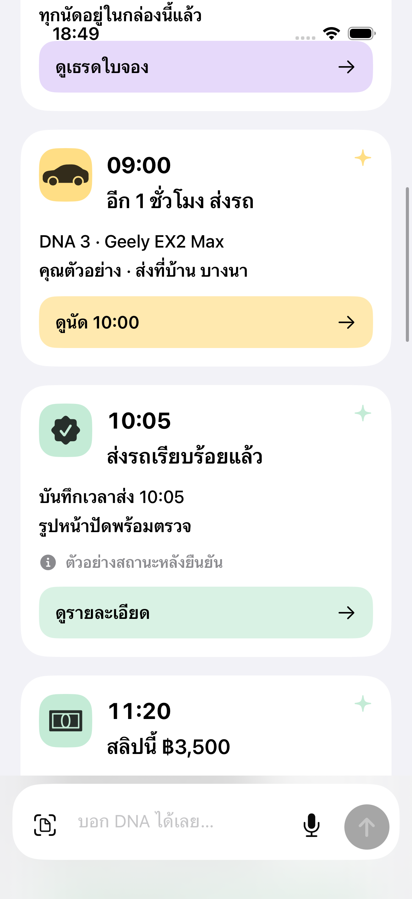
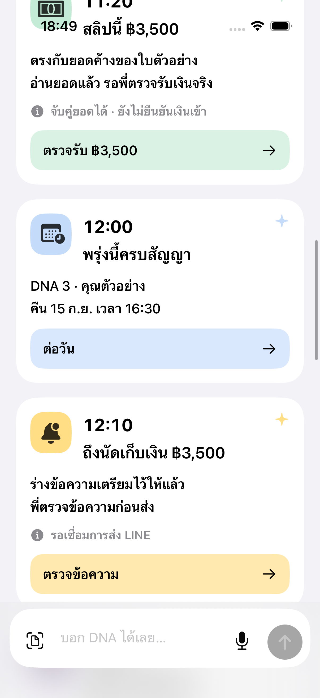
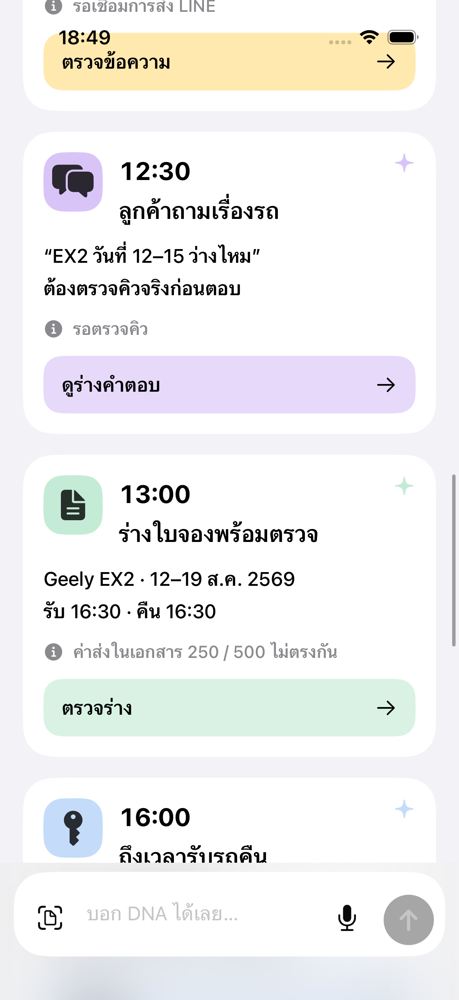
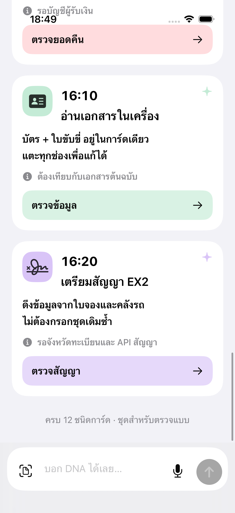

# ภาพหน้าจอเดิมจาก Simulator — ข้อ 3.5

ส่งภาพเดิม 3 กลุ่ม รวม 9 PNG ตามคำสั่ง 8 กันยายน 2569 ไม่ออกแบบใหม่ ไม่ส่งโค้ด สเปกข้อความตามภายหลัง ภาพต้นฉบับ 1206×2622px โหมดสว่าง ใช้ข้อมูลตัวอย่าง ไม่ใช่ข้อมูลลูกค้าจริง และไม่ใช่หลักฐานว่าระบบงานจริงเชื่อมแล้ว

## กล่องเดียว — ด้านบน

ภาพเลื่อนต่อเนื่อง 5 ช่วง รวมช่วงบนครอบคลุมตัวอย่างการ์ดเดิม 12 ชนิด:

## เธรดใบจองหนึ่งใบ — ด้านบน

## หลังแตะปิดจ๊อบ — หน้าที่กางอยู่จริง

**ข้อจำกัดของงานเดิม:** ปุ่ม “ปิดจ๊อบ” ในเธรดเปิดหน้าตรวจร่างนำเข้าทั่วไป ยังไม่มีการ์ดรับคืนรถเฉพาะที่สมบูรณ์ ภาพนี้เป็นหน้าที่เปิดจริง ไม่สร้างภาพทดแทนแล้วอ้างว่ามีอยู่แล้ว และไม่ใช่หลักฐานปิดงานสำเร็จ

## ข้อสังเกตสำหรับประกอบต่อ

- สีและข้อความเป็นแบบเดิม ยังไม่ได้ปรับเป็นโทเคนแอปจริง การ์ดสลิปและคำตอบลูกค้าเป็นตัวอย่าง ไม่ได้ต่อความสามารถจริง
- ตัวเลขตัวอย่างไม่ใช่ค่าว่างของระบบจริง จุดที่ไม่มีข้อมูลให้ใช้ — ตามใบสั่งงาน
- ภาพเดิมมีเนื้อหาเลื่อนผ่านใต้แถบสถานะและบางส่วนอยู่หลังช่องพิมพ์ด้านล่าง ให้ C รักษาพื้นที่ปลอดภัยเมื่อประกอบเว็บจริง ภาพชุดนี้ไม่ได้รับรองจอ 375px หรือโหมดมืด
- ฟอร์มรับคืนรถเฉพาะและสเปกข้อความยังต้องประกอบต่อ ภาพหน้าตรวจร่างทั่วไปไม่ใช่สิ่งทดแทนฟอร์มรับคืนรถ

ตามข้อ 7 ให้ประกอบการ์ดปิดจ๊อบรับคืนรถก่อน ตามด้วยคืนเงินประกันและสรุปวันนี้ งานที่เชื่อมหลังบ้าน/สูตรเงิน/สิทธิ์ให้ C ประกอบตามระบบจริง
