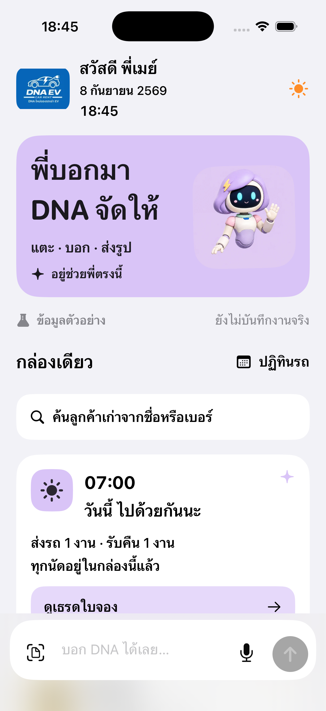
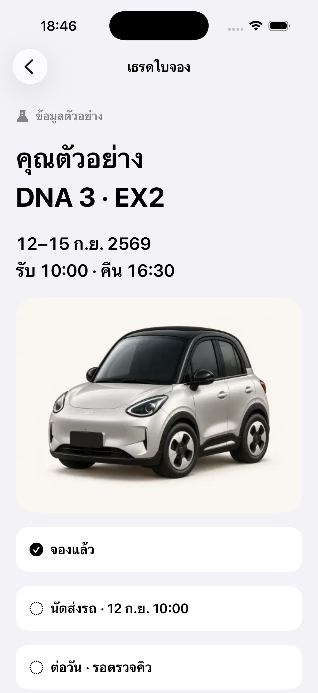

# ภาพหน้าจอเดิมจาก Simulator — ข้อ 3.5

ส่งภาพเดิมก่อนตามคำสั่ง 8 กันยายน 2569 ไม่ออกแบบใหม่ ไม่ส่งโค้ด สเปกข้อความตามภายหลัง ภาพใช้ข้อมูลตัวอย่าง ไม่ใช่ข้อมูลลูกค้าจริง และไม่ใช่หลักฐานว่าระบบงานจริงเชื่อมแล้ว

## กล่องเดียว — ด้านบน

## เธรดใบจองหนึ่งใบ — ด้านบน

## ภาพที่กำลังส่งต่อ

ช่วงเลื่อนของกล่องเดียวและเธรด พร้อมหน้าหลังแตะ “ปิดจ๊อบ” จะเพิ่มในชุดนี้ทันทีที่แคปครบ โดยไม่รอสเปก

ข้อจำกัดของงานเดิม: ปุ่ม “ปิดจ๊อบ” ในเธรดเปิดหน้าตรวจร่างทั่วไป ยังไม่มีการ์ดรับคืนรถเฉพาะที่สมบูรณ์ จะส่งภาพจริงของหน้าที่เปิด ไม่สร้างภาพทดแทนแล้วอ้างว่ามีอยู่แล้ว

ตามข้อ 7 ให้ประกอบการ์ดปิดจ๊อบรับคืนรถก่อน ตามด้วยคืนเงินประกันและสรุปวันนี้ งานที่เชื่อมหลังบ้าน/สูตรเงิน/สิทธิ์ให้ C ประกอบตามระบบจริง
