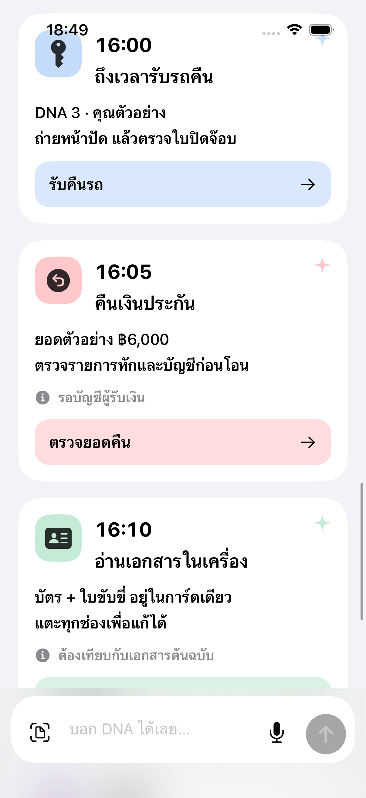
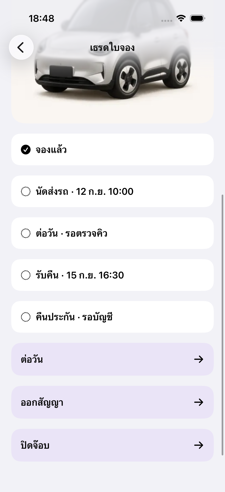
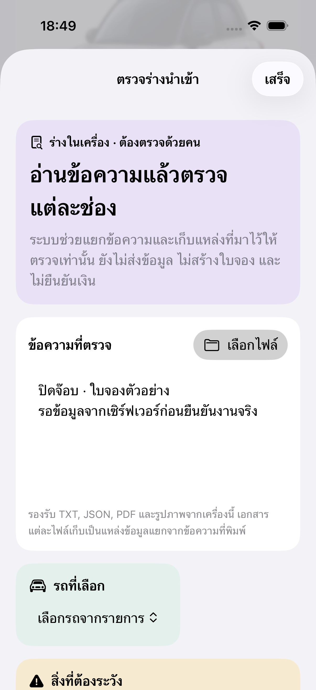

# DNA EV — รายงานจุดเคลื่อนไหวประกอบภาพหน้าจอ

ส่งให้ C ประกอบกับภาพหน้าจอเดิม ตามคำสั่งเจ้าของวันที่ 8 กันยายน 2569. เอกสารนี้มีเฉพาะภาพอ้างอิงและสเปกข้อความ ไม่มีโค้ด ไม่ออกแบบจอ 1–2–3 ใหม่ และไม่เปลี่ยนสูตรเงินหรือสิทธิ์ของระบบ

## อ่านสถานะงานก่อนประกอบ

- **มีอยู่แล้ว:** ภาพชุดนี้แคปจาก Simulator ที่ใช้ข้อมูลตัวอย่าง มีรายการการ์ดในกล่องเดียว เธรดใบจอง และหน้าที่เปิดจริงหลังแตะปิดจ๊อบ
- **ข้อจำกัดสำคัญ:** ภาพหลังแตะปิดจ๊อบเป็น “ตรวจร่างนำเข้า” ทั่วไป ยังไม่ใช่ฟอร์มรับคืน/รายการหัก/ยอดคืนเงินที่สมบูรณ์ ห้ามใช้ภาพนี้รับรองว่าปิดจ๊อบจริงได้แล้ว
- **ที่ตรวจจากต้นแบบ:** เลขาในจอ “กล่องเดียว” ใช้การเอียงสลับประมาณ −2° ถึง +2° และยกจาก +2 ถึง −4 หน่วย ระยะ 2.4 วินาทีต่อเที่ยว วนไปกลับ; โหมดลดการเคลื่อนไหวให้ภาพนิ่ง. ไม่ใช่หลักฐานว่าพฤติกรรม lifecycle ทั้งหมดผ่าน และไม่ใช่คลิปทักทาย Home คนละรุ่น
- **ข้อเสนอให้ C ประกอบ:** ระยะและเวลาทุกค่าในตารางด้านล่างเป็นค่าเป้าหมายของดีไซน์ ไม่ใช่ผลวัดจากภาพนิ่งหรือคำกล่าวว่าแอปจริงทำครบแล้ว. อ่านตำแหน่งจากชื่อชิ้นงานในภาพ ไม่อิงพิกัดพิกเซลของภาพแคป
- ใช้หน่วยระยะ CSS px และเวลา ms สำหรับ PWA; ภาพแคปไม่ใช่ขนาด CSS จริง. คงโทเคนสีที่ C ระบุในใบสั่งงาน ไม่มีจานสีใหม่

## ภาพ A — กล่องเดียว / สรุปวันนี้

จุด A1 อยู่ที่ตัวเลขาขวาในกรอบม่วง; A2 คือการ์ดงานแต่ละใบใต้ “กล่องเดียว”; A3 คือไอคอนดวงอาทิตย์ในการ์ดสรุปวันนี้; A4 คือช่องพิมพ์และปุ่มล่างจอ. ชื่อและตัวเลขในภาพเป็นข้อมูลตัวอย่าง ไม่ใช้เป็นค่าจริง

| จุดที่ขยับ | เริ่มเมื่อ / วิธีขยับที่เสนอ | เวลา / จังหวะ | ส่วนที่ต้องนิ่ง / หยุดเมื่อ |
|---|---|---|---|
| A1 เลขาตอบรับ | หน้าแสดงพร้อมและตัวเลขาอยู่ในจอ: ยุบภาพเล็กน้อย 1→0.98 แล้วลอยขึ้น 4px เอียงไม่เกิน 2° ก่อนกลับสู่ท่าเดิม | 100 ยุบ + 240 ยก + 340 กลับ รวม 680; เริ่มนุ่ม จบผ่อน ไม่มีสั่นต่อท้าย | ขยับภาพตัวละครเดิมทั้งชิ้น ไม่วาดหน้า/มือใหม่ ไม่พาหัวข้อหรือกรอบม่วงโยก. เล่นหนึ่งครั้งเมื่อเข้าใหม่ ไม่วนทั้งวันที่เปิดหน้าไว้. ไม่เพิ่มปุ่มแตะเลขาหรือคำสั่งใหม่โดยไม่ได้ตกลง |
| A2 การ์ดใหม่เข้ากล่อง | หลังรับข้อมูลจริงของการ์ดใหม่: ยกจากด้านล่าง 8px พร้อมค่อย ๆ ชัด | 220; ถ้ามาพร้อมกันหลายใบ เหลื่อมเฉพาะใบที่มองเห็น 40 ต่อใบ สูงสุด 3 ใบ | การ์ดเดิมไม่เล่นซ้ำทุกครั้งที่เลื่อนผ่าน. ไม่สลับลำดับหรือเลื่อนจอหนีตำแหน่งที่ผู้ใช้กำลังอ่าน |
| A3 ไอคอนสรุปวันนี้ | เมื่อสรุปของวันนั้นอ่านสำเร็จและเห็นการ์ดครั้งแรก: ไอคอนดวงอาทิตย์เอียง −3°→+3°→0° เบา ๆ | 360; เล่นครั้งเดียวต่อข้อมูลชุดนั้น | เวลา จำนวนงาน เงิน และข้อความทุกบรรทัดนิ่ง. ไม่ไล่นับตัวเลขจากศูนย์ ไม่เปลี่ยนค่าที่ยังไม่มีเป็นศูนย์ |
| A4 ปุ่มสแกน/ไมค์/ตรวจข้อความ | กด: พื้นหรือขอบเข้มขึ้นเล็กน้อย; ปล่อย: คืนสภาพ. ถ้าเริ่มอัดเสียงได้จริงจึงเปลี่ยนไมค์เป็นสถานะหยุด พร้อมคำว่า “กำลังฟัง…” | กด 80 / คืน 120; ระหว่างฟังใช้สถานะนิ่งพร้อมข้อความ ไม่จำเป็นต้องมีวงวิ่ง | การกดไม่ใช่หลักฐานว่าเริ่มฟังหรือสแกนได้. ถ้าสิทธิ์ถูกปฏิเสธอย่าแสดงว่ากำลังทำงาน. แถบพิมพ์อยู่ในพื้นที่ปลอดภัยเหนือคีย์บอร์ด ไม่เด้งตามการ์ด |
| A5 ปุ่มหลักในการ์ดและลูกศร | hover เฉพาะเครื่องมีเมาส์ หรือ focus จากคีย์บอร์ด: เน้นขอบ; กดแล้วลูกศรเลื่อนไปขวา 3px แล้วกลับ | ลูกศรไป 100 / กลับ 140; ไม่รอเอฟเฟกต์ก่อนเปิดปลายทาง | ไม่ขยายข้อความหรือการ์ดทั้งใบ. เลื่อนนิ้วเพื่อ scroll/cancel ต้องไม่เปิดปลายทาง |

**ไม่มีข้อมูล:** ค่าที่ไม่มีขึ้น “—”; ถ้ายังอ่านไม่สำเร็จต้องมี “กำลังโหลด” หรือ “อ่านข้อมูลไม่ได้” แยกจากรายการว่าง. ไม่สร้างการ์ดรายได้/คิวจากจำนวนในภาพตัวอย่าง. ช่วงโหลดไม่ให้เลขาแสดงเครื่องหมายผ่าน

## ภาพ A6 — รับคืนรถ / คืนเงินประกันในกล่องเดียว

| การ์ด / ตำแหน่ง | การเคลื่อนไหวที่เสนอ | สถานะและข้อมูลที่ผูกจริง |
|---|---|---|
| “ถึงเวลารับรถคืน” — ไอคอนกุญแจซ้ายบน | เมื่อการ์ดใหม่ปรากฏ ใช้ A2; แตะปุ่ม “รับคืนรถ” ใช้ A5. ไม่เขย่ากุญแจซ้ำหรือย้ายคิวในภาพ | ลำดับความเร่งด่วนให้ C ใช้กฎงานจริง. ต้องผูกใบจอง รถ เวลานัด และสิทธิ์ผู้ใช้; เปิดหน้าตรวจยังไม่ใช่รับคืนแล้ว |
| “คืนเงินประกัน” — ไอคอนซ้ายบนและป้ายเตือนใต้ข้อความ | ก่อนตรวจ: นิ่ง. ถ้ามีข้อมูลบัญชีหรือรายการหักเปลี่ยน ให้ป้ายเตือนค่อย ๆ ชัด 140ms โดยไม่กระพริบ. หลังระบบยืนยันคืนเงินจริง: ไอคอนผ่านค่อย ๆ ชัด 160ms หนึ่งครั้ง | กด “ตรวจยอดคืน” ไม่เท่ากับโอนเงินแล้ว. ผูกใบจอง ยอดที่คำนวณจากระบบ รายการหัก บัญชีที่ตรวจได้ตามสิทธิ์ และผลรายการจริง. ไม่มีเงิน/เหรียญบินหรือ confetti |

ทั้งสองใบคงลำดับและเนื้อหาที่ C ยืนยัน ไม่เปลี่ยนสูตรเพื่อให้เข้ากับภาพ. สถานะเตือนมีข้อความและไอคอนประกอบ ไม่ใช้สีหรือการเคลื่อนไหวอย่างเดียว

## ภาพ B — เธรดใบจองหนึ่งใบ

| จุดที่ขยับ | เริ่มเมื่อ / วิธีขยับที่เสนอ | เวลา | ข้อจำกัด |
|---|---|---|---|
| B1 เปิดเธรดจากการ์ด | จอใหม่เลื่อนจากขวา 12px พร้อมค่อย ๆ ชัด; กลับใช้ทิศย้อน. ถ้า host มี transition เดิมอยู่แล้ว ใช้ของเดิมหนึ่งชั้น ไม่ซ้อนสองชุด | เข้า 220 / กลับ 180 | ต้องเปิดใบจองที่ผู้ใช้เลือกจริง ไม่ใช้ชื่อรุ่นหาแล้วเลือกคันแรก. รักษาจุดเลื่อนในกล่องเดิมเมื่อกลับ |
| B2 รูปรถในเธรด | รูปที่ตรงรถโหลดและตรวจคู่สำเร็จแล้ว: เผยภาพจากด้านล่าง 6px พร้อมชัดขึ้นหนึ่งครั้ง | 240 | ไม่เอียง/หมุนรถจริงให้เสียมุม ไม่เปลี่ยนสี ไม่ทำป้ายทะเบียนไหว. ถ้ารูปยังไม่ยืนยันใช้พื้นที่ภาพกลาง ไม่ใช้รูปรุ่นอื่น. การเผยภาพไม่ใช่ยืนยันรถว่างหรือการจอง |
| B3 ไทม์ไลน์สถานะ | ผลงานจริงเปลี่ยน: ค่อย ๆ เปลี่ยนไอคอนและข้อความของแถวนั้น; ถ้ามีรายการใหม่ใช้เลื่อน 6px + fade | เปลี่ยน 160 / แถวใหม่ 220 | แถวอื่น ชื่อลูกค้า วัน เวลา และตัวเลขนิ่ง. ห้ามติ๊กผ่านเรียงทุกขั้นอัตโนมัติเพียงเพราะเปิดเธรด |
| B4 “ต่อวัน / ออกสัญญา / ปิดจ๊อบ” | ใช้ feedback A5 แล้วเปิดหน้าที่รองรับทันที. ขณะรอผลจริง ปิดการส่งซ้ำและแสดง “กำลังดำเนินการ…” | feedback 80–140; เวลาเปิดตาม B1 หรือ C1 ไม่ใช้ทั้งสองพร้อมกัน | อย่าแสดงความสำเร็จหลัง timeout. กลับเธรดหรือเปิดร่างอีกครั้งต้องไม่ทำให้ส่งคำขอเดิมซ้ำได้ |

## ภาพ C — หน้าที่เปิดอยู่จริงหลังแตะปิดจ๊อบ

**ข้อเท็จจริงของภาพนี้:** หัวหน้าต่างคือ “ตรวจร่างนำเข้า” และมีข้อความร่างปิดจ๊อบอยู่ข้างใน. ปุ่ม “เสร็จ” คือปิดหน้าต่างเดิม ไม่ใช่บันทึกปิดจ๊อบ. ใช้ภาพเพื่อดูโครงหน้าต่างและพื้นที่อ่านเท่านั้น; ฟอร์มรับคืน/รายการหัก/ยอดคืนเฉพาะยังเป็นส่วนที่ C ต้องประกอบ ไม่แกล้งใส่สถานะสำเร็จในภาพนี้

| จุดที่ขยับ | การเคลื่อนไหวที่เสนอ | เวลา / เงื่อนไข |
|---|---|---|
| C1 หน้าต่างตรวจ | เลื่อนแผงขึ้นจากด้านล่างประมาณ 24px พร้อมพื้นหลังค่อย ๆ มืดลง; ปิดย้อนทางเดิม. ไม่ใช้ bounce ในงานเงิน | เปิด 260 / ปิด 180. โฟกัสเข้าหัวข้อหรือช่องแรกตามงาน; ปิดแล้วคืนโฟกัสปุ่มที่เปิด |
| C2 ช่องที่ตรวจพบปัญหา | ขอบและข้อความเตือนค่อย ๆ ชัด ใช้โทเคนเตือนเดิม; ถ้าต้องเลื่อนให้เห็นช่อง เลื่อนเท่าที่จำเป็นและไม่ย้ายโฟกัสซ้ำ | 140; ไม่เขย่าหน้าต่าง ไม่ลบค่าที่กรอก ไม่สั่นตัวเลข |
| C3 ผลปิดจ๊อบในฟอร์มจริงภายหลัง | หลังผลยืนยันตรงใบจองและคำขอ: ไอคอนผ่านปรากฏนุ่ม 160ms และข้อความ “ปิดจ๊อบแล้ว” พร้อมเวลาจริง; คงพื้นที่สรุปให้อ่านก่อนกลับ | **ยังไม่มีในภาพนี้**. ห้ามใช้กับปุ่ม “เสร็จ” ของหน้าตรวจร่าง. การปิดจ๊อบไม่เท่ากับคืนเงินประกันแล้ว ต้องแยกผลสองรายการ |

## กฎร่วมสำหรับ C

1. **รักษาดีไซน์:** ขยับเฉพาะชิ้นที่แยกจากข้อความได้ ใช้ภาพไอคอน/เลขาต้นแบบเดิม ไม่วาดทดแทน. ถ้าภาพเป็นไอคอนรวมตัวหนังสือ ให้ใช้ขอบ/พื้นตอบรับแทนการขยายทั้งภาพ. รอบนี้ไม่เพิ่มเอฟเฟกต์ล้นทับข้อมูลหรือปุ่ม
2. **โหมดลดการเคลื่อนไหว:** ตัดการยก เอียง ย่อ ขยาย ลูกศรเลื่อน และ stagger ทั้งหมด. เปลี่ยนสถานะทันที หรือ fade ไม่เกิน 100ms เมื่อเหมาะสม; ข้อความและการใช้งานครบเหมือนเดิม
3. **หยุดอย่างมีเหตุผล:** หยุดเอฟเฟกต์เมื่อออกหน้า ตัวละคร/การ์ดพ้นจอ แอปเสีย focus หรือเปิด Reduce Motion; คืนภาพนิ่งโดยไม่เล่นใหม่เองเมื่อกลับ. หยุดภาพเคลื่อนไหวไม่ใช่ยกเลิกคำขอที่อาจเขียนข้อมูลแล้ว
4. **ไม่เล่นซ้อน:** การกดระหว่างเอฟเฟกต์เดิมไม่เพิ่มคิวเอฟเฟกต์. ปุ่มเปลี่ยนหน้าตอบสนองทันที; ปุ่มเขียนผูกการกันซ้ำกับรายการจริง ไม่ใช่กับเวลาจบแอนิเมชัน
5. **โหลด / ผิดพลาด / ยังไม่ทราบผล:** มีข้อความนิ่งอ่านได้เสมอ. ไม่ใช้สีเขียว/เครื่องหมายผ่านกับการอ่านข้อมูลหรือกดส่งเฉย ๆ. ถ้ายังไม่ทราบผลให้คงร่างและติดตามรายการเดิม ไม่ส่งซ้ำอัตโนมัติ
6. **ตัวเลขนิ่ง:** ยอดเงิน จำนวนงาน วันเวลา และทะเบียนไม่เด้ง ไม่วิ่งนับ และไม่เปลี่ยนตามจังหวะ. ค่าที่ไม่มีใช้ “—” พร้อมสถานะที่ถูกต้อง ไม่เติมตัวเลขจากภาพ
7. **ข้อมูลและสิทธิ์:** C ใช้ข้อมูล/กฎ/การตรวจสิทธิ์/บันทึกหลักฐานของระบบจริง. ชื่อและรถในภาพนี้เป็นตัวอย่าง ไม่ใช่ทะเบียนรถจริงหรือรายชื่อลูกค้าที่ต้องนำเข้า. ไม่ใส่เปอร์เซ็นต์ความมั่นใจ AI
8. **สี:** ใช้ชื่อโทเคนในใบสั่งงาน เช่น `--ink`, `--muted`, `--line`, `--blue`, `--amber`, `--green`, `--red`; ไม่แปลพื้น pastel ในภาพว่าให้แทนจานสี production ทั้งชุด. ตรวจโหมดสว่าง/มืดและความชัดของสถานะหลัง C ผูกโทเคน

## เกณฑ์ตรวจหลัง C ประกอบ

- เปิดที่กว้าง 375px และ 390px ทั้งสว่าง/มืด: ข้อความยาว ตัวเลขจริงแบบสังเคราะห์ และปุ่มไม่ล้น; คีย์บอร์ดไม่บังการกระทำหลัก
- ตรวจทุก trigger ด้วยเมาส์ สัมผัส และคีย์บอร์ดที่รองรับ; กดแล้วเลื่อนหนีต้องไม่ทำรายการ. ชื่อการควบคุมและข้อความสถานะอ่านด้วยเครื่องมือช่วยการเข้าถึงได้
- เปิด/ปิด Reduce Motion ระหว่างเล่น รวมถึงออกหน้า/กลับหน้า: ไม่เหลือภาพค้างผิดตำแหน่ง ไม่วนใหม่ และไม่ส่งงานซ้ำ
- การเปิด/ปิดหน้าต่างไม่เปลี่ยนเงินหรือสถานะใบจอง. success ต้องมาจากผลตรงรายการ; unknown/result เก่า/กดซ้ำ/กลับร่างไม่สร้างคำขอใหม่ซ้อน
- จับคลิปสั้นจากแอปที่ C ประกอบพร้อมระบุหน้าจอและสถานะที่ทดสอบ ส่งกลับ `to-gpt/` ให้ตรวจจังหวะ; ภาพนิ่งชุดนี้ยังใช้รับรองความลื่นหรือการเชื่อมข้อมูลไม่ได้

**ลำดับประกอบ:** ปิดจ๊อบรับคืนรถ → คืนเงินประกัน → สรุปวันนี้ ตามใบสั่งงานเดิม. เอกสารนี้เพิ่มรายละเอียด “ตรงไหนขยับ” ไม่เพิ่มเมนู ไม่ขยาย Fleet ไม่ส่งโค้ด และไม่อนุญาต deploy แทนคำสั่งเจ้าของ
